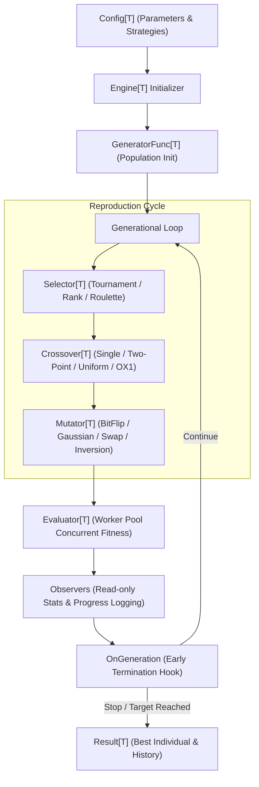
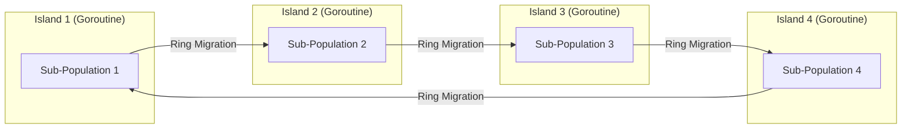

# 🧬 genetic

**A type-safe, extensible genetic algorithm library for Go**  
*Designed for reproducible experimentation, parallel fitness evaluation, and optimization research.*

[](https://github.com/Semplicementeio/Genetic-Algorithm/actions)
[](https://pkg.go.dev/github.com/Semplicementeio/Genetic-Algorithm)
[](https://goreportcard.com/report/github.com/Semplicementeio/Genetic-Algorithm)

> **Library Status**: `v0.2.0` (Active Development, API stability: breaking changes may occur prior to `v1.0.0`).

---

## 📋 Table of Contents

- [Why genetic?](#-why-genetic)
- [Results at a Glance](#-results-at-a-glance)
- [Architecture](#-architecture)
- [Installation & Requirements](#-installation--requirements)
- [Quick Start](#-quick-start)
- [Advanced Features](#-advanced-features)
  - [Island Model GA (Coarse-Grained Parallelism)](#1-island-model-ga-coarse-grained-parallelism)
  - [Observers & Control Hooks](#2-observers--control-hooks)
  - [Deterministic Execution & Seeded PRNG](#3-deterministic-execution--seeded-prng)
- [Pluggable Strategy Matrix](#-pluggable-strategy-matrix)
- [Real-World Problem Examples](#-real-world-problem-examples)
- [Empirical Benchmarks & Evaluation](#-empirical-benchmarks--evaluation)
  - [Population Sizing Throughput](#1-population-sizing-throughput)
  - [Worker Pool Parallel Scalability](#2-worker-pool-parallel-scalability)
  - [Comparative Algorithm Evaluation (GA vs SA vs Random Search)](#3-comparative-algorithm-evaluation-ga-vs-simulated-annealing-vs-random-search)
  - [Island Model Evaluation (Single Pop vs 4 Islands vs 8 Islands)](#4-island-model-evaluation-single-pop-vs-4-islands-vs-8-islands)
- [Key Design Decisions](#-key-design-decisions)
- [Engineering Trade-offs: When NOT to Use](#-engineering-trade-offs-when-not-to-use)
- [Roadmap](#-roadmap)
- [Testing & Quality Assurance](#-testing--quality-assurance)
- [Technical Documentation](#-technical-documentation)
- [Citation](#-citation)
- [License](#-license)

---

## 🤔 Why `genetic`?

Many real-world optimization problems—such as resource scheduling, route planning, knapsack item selection, and continuous function optimization—involve search spaces that are **non-convex**, **non-differentiable**, or **combinatorially complex** ($NP$-hard).

`genetic` is built for evolutionary optimization in Go. Key design goals:

- **Type-Safe Generics**: Uses Go generics (`[T any]`) to provide compile-time type safety while allowing the evolutionary engine to operate on different genome representations without reflection or manual type assertions.
- **Parallel Fitness Evaluation**: Candidate solutions are evaluated concurrently using a persistent bounded worker pool, scaling across multi-core processors with race-detector coverage (`go test -race`).
- **Island Model GA (`IslandEngine[T]`)**: Supports coarse-grained parallel evolution across independent sub-populations with periodic migration topologies to help maintain population diversity and reduce premature convergence.
- **Deterministic & Reproducible**: A fixed random seed produces reproducible evolutionary runs under the same algorithm configuration across different worker pool counts.
- **Clean Observer Architecture**: Strictly separates read-only metrics monitoring (`Observers`) from early termination control logic (`OnGeneration`).
- **Zero External Dependencies**: The library relies only on the Go standard library, keeping the runtime dependency graph minimal.

---

## ⚡ Results at a Glance

Evaluated on Rastrigin (5D multi-modal) and Ackley (5D global basin) functions across 30 independent trials (seeds 42–71) with a fixed budget of ~10,000 fitness evaluations per run:

| Problem | Architecture / Algorithm | Success Rate (<0.1) | Best Min Found | Mean ± StdDev | Avg Time |
|---------|-------------------------|---------------------|----------------|---------------|----------|
| **Rastrigin 5D** | **Island GA (8 Islands)** | **37%** (vs 17% Single GA, 0% SA) | **0.000466** | **1.1932 ± 1.2433** | **3.56 ms** |
| | Single Population GA | 17% | 0.000139 | 1.8579 ± 1.2776 | 6.05 ms |
| | Simulated Annealing (SA) | 0% | 3.979875 | 32.6073 ± 12.1240 | 1.54 ms |
| | Random Search (RS) | 0% | 10.113479 | 16.0248 ± 2.6549 | 1.75 ms |
| **Ackley 5D** | **Single Population GA** | **100%** (vs 23% SA, 0% RS) | **0.001100** | **0.0028 ± 0.0011** | **6.61 ms** |

*All benchmark results are generated by [`examples/optimization/main.go`](examples/optimization/main.go). Detailed methodology $\rightarrow$ [docs/experiments.md](docs/experiments.md)*

---

## 🏗️ Architecture

### 1. Evolutionary Engine Pipeline



### 2. Island Model Migration Topology



---

## 📦 Installation & Requirements

Uses Go generics and targets **Go 1.22+**:

```bash
go get github.com/Semplicementeio/Genetic-Algorithm
```

---

## 🚀 Quick Start

```go
package main

import (
	"fmt"
	"math/rand"
	"github.com/Semplicementeio/Genetic-Algorithm/genetic"
)

func main() {
	target := []byte("EVOLUTIONARY OPTIMIZATION IN GO")
	alphabet := "ABCDEFGHIJKLMNOPQRSTUVWXYZ "

	cfg := genetic.Config[[]byte]{
		PopulationSize: 150,
		Generations:    200,
		MutationRate:   0.04,
		CrossoverRate:  0.85,
		ElitismCount:   3,
		NumWorkers:     4,
		Seed:           42,
		Generator: func(rng *rand.Rand) []byte {
			g := make([]byte, len(target))
			for i := range g {
				g[i] = alphabet[rng.Intn(len(alphabet))]
			}
			return g
		},
		FitnessFunc: func(g []byte) float64 {
			fit := 0.0
			for i := range g {
				if g[i] == target[i] {
					fit += 1.0
				}
			}
			return fit
		},
		Selector:  genetic.NewTournamentSelection[[]byte](3),
		Crossover: genetic.NewSinglePointCrossover[[]byte, byte](),
		Mutator:   genetic.NewByteMutation(alphabet),
	}

	engine, err := genetic.NewEngine(cfg)
	if err != nil {
		panic(err)
	}

	res, err := engine.Run()
	if err != nil {
		panic(err)
	}

	fmt.Printf("Evolved Solution: %s (Fitness: %.0f/%d in %v)\n",
		string(res.BestIndividual.Genome), res.BestIndividual.Fitness, len(target), res.TotalDuration)
}
```

### Sample Output

```text
Evolved Solution: EVOLUTIONARY OPTIMIZATION IN GO (Fitness: 31/31 in 18.42ms)
```

---

## 🔬 Advanced Features

### 1. Island Model GA (Coarse-Grained Parallelism)

`IslandEngine[T]` runs multiple sub-populations ("islands") concurrently on separate goroutines. At configurable intervals, elite individuals migrate between islands according to a selected topology such as Ring or Random, helping maintain diversity and reduce premature convergence:

```go
baseCfg := genetic.Config[[]float64]{ /* base configuration */ }

islandCfg := genetic.IslandConfig[[]float64]{
	NumIslands:           4,                  // 4 parallel islands
	IslandPopulationSize: 50,                 // 50 individuals per island
	EpochGenerations:     10,                 // migrate every 10 generations
	MigrationCount:       2,                  // 2 elites exchanged per epoch
	TotalGenerations:     100,
	Topology:             genetic.RingTopology,
	BaseConfig:           baseCfg,
}

islandEngine, err := genetic.NewIslandEngine(islandCfg)
if err != nil {
	panic(err)
}

res, err := islandEngine.Run()
```

### 2. Observers & Control Hooks

`genetic` separates read-only logging observers from control callbacks:

```go
// Read-only observers for monitoring & logging
cfg.Observers = []func(genetic.GenerationStats, genetic.Population[T]){
	func(stats genetic.GenerationStats, pop genetic.Population[T]) {
		fmt.Printf("Gen %d | Best: %.4f | Avg: %.4f | StdDev: %.4f\n",
			stats.Generation, stats.BestFitness, stats.AvgFitness, stats.StdDev)
	},
}

// Control callback hook: return false to terminate evolution early
cfg.OnGeneration = func(stats genetic.GenerationStats, pop genetic.Population[T]) bool {
	// Stop early if target fitness reached OR diversity drops below threshold
	targetReached := stats.BestFitness >= 100.0
	diversityCollapsed := stats.StdDev < 0.0001
	return !targetReached && !diversityCollapsed
}
```

### 3. Deterministic Execution & Seeded PRNG

A fixed random seed (`Seed: 42`) produces reproducible fitness trajectories and final results under the same configuration. Random number generation is confined to the evolutionary control path, while fitness evaluation is deterministic and side-effect free, making results reproducible across worker-pool sizes.

---

## 🧩 Pluggable Strategy Matrix

| Category | Strategy Operator | Genome Type | Primary Use Case |
|----------|-------------------|-------------|------------------|
| **Selection** | `TournamentSelection[T]` | `T any` | General use; adjustable selection pressure $K$ |
| | `RouletteWheelSelection[T]` | `T any` | Fitness-proportionate selection |
| | `RankSelection[T]` | `T any` | High fitness variance environments |
| | `ExtractElite[T]` | `T any` | Elitism: carries top $N$ individuals forward |
| **Crossover** | `SinglePointCrossover[T, E]` | `T ~[]E` | Standard positional slice genomes |
| | `TwoPointCrossover[T, E]` | `T ~[]E` | Preserves non-contiguous gene blocks |
| | `UniformCrossover[T, E]` | `T ~[]E` | Fine-grained element swapping |
| | `OrderCrossover[T, E]` (OX1) | `T ~[]E, E comparable` | Permutations (TSP, task ordering) |
| **Mutation** | `BitFlipMutation` | `[]bool` | Binary bitsets |
| | `GaussianMutation` | `[]float64` | Continuous numerical vectors |
| | `SwapMutation[T, E]` | `T ~[]E` | Swapping elements in permutations |
| | `InversionMutation[T, E]` | `T ~[]E` | Reversing sub-slices in permutations |

---

## 💡 Real-World Problem Examples

The repository includes 4 runnable problem domain implementations in `examples/`:

1. **0/1 Knapsack Problem** ([`examples/knapsack`](examples/knapsack)): Binary representation (`[]bool`) maximizing total item value subject to weight capacity.
2. **Traveling Salesman Problem (TSP)** ([`examples/tsp`](examples/tsp)): Permutation representation (`[]int`) minimizing route distance across 20 cities with OX1 crossover and ASCII route visualization.
3. **Mathematical Function Optimization** ([`examples/optimization`](examples/optimization)): Continuous vector optimization benchmarking GA against Simulated Annealing (SA) and Random Search (RS) on Rastrigin and Ackley multi-modal functions.
4. **Job Shop Task Scheduling** ([`examples/scheduling`](examples/scheduling)): Integer machine assignment representation (`[]int`) minimizing overall makespan across parallel processing units.

Run any example:

```bash
go run ./examples/knapsack
go run ./examples/tsp
go run ./examples/optimization
go run ./examples/scheduling
```

---

## 📊 Empirical Benchmarks & Evaluation

All empirical results in this section are generated by [`examples/optimization/main.go`](examples/optimization/main.go) and can be reproduced locally:

```bash
go test -bench=. -benchmem ./benchmarks
go run ./examples/optimization
```

### 1. Population Sizing Throughput

*Environment: AMD Ryzen 5 5500U (6 Cores / 12 Threads), Linux x86_64, Go 1.22.2*

| Benchmark | Population Size | Generations | Time / Op | Allocations / Op | Memory / Op |
|-----------|-----------------|-------------|-----------|------------------|-------------|
| `BenchmarkPopulationSizes/PopSize-100` | 100 | 50 | **4.42 ms** | 9,430 allocs | 1.38 MB |
| `BenchmarkPopulationSizes/PopSize-500` | 500 | 50 | **21.38 ms** | 45,041 allocs | 6.83 MB |
| `BenchmarkPopulationSizes/PopSize-1000` | 1,000 | 50 | **47.35 ms** | 89,702 allocs | 13.66 MB |
| `BenchmarkPopulationSizes/PopSize-5000` | 5,000 | 50 | **243.68 ms** | 446,681 allocs | 68.27 MB |

### 2. Worker Pool Parallel Scalability

Measuring throughput speedup on a synthetic multi-dimensional fitness function:

| Worker Count | Execution Time (ns/op) | Throughput Speedup | Parallel Efficiency |
|--------------|------------------------|-------------------|---------------------|
| **1 Worker** (Sequential) | 5,561,900,811 ns | **1.00x** | 100% |
| **2 Workers** | 2,868,093,249 ns | **1.94x** | 97% |
| **4 Workers** | 3,113,030,915 ns | **1.79x** | 45% |
| **8 Workers** | 2,148,099,920 ns | **2.58x** | 32% |
| **16 Workers** | 1,807,508,746 ns | **3.08x** | 19% |

> **Performance Analysis**: Performance peaks near 2 workers for this benchmark workload ($1.94\times$ speedup) because fitness evaluation is not the sole component of the evolutionary loop; selection, crossover, mutation, and elitism run on the main thread, so channel synchronization and thread scheduling bound maximum scalability per **Amdahl's Law**.

### 3. Comparative Algorithm Evaluation (GA vs Simulated Annealing vs Random Search)

*Experimental Methodology: Dimension $d=5$, Search Space $[-5.12, 5.12]^5$, $N=30$ Independent Trials (Seeds 42–71), Fixed Budget of 10,000 Fitness Evaluations per Run (including initial population evaluation), Success Threshold $< 0.10$.*

> **Scientific Scope & Statistical Caveat**: Results are workload- and parameter-dependent; these experiments are intended to characterize this implementation under the specified evaluation budget, not to establish a general superiority of GA over other optimization methods. With 30 trials per benchmark configuration, these results should be interpreted as empirical evidence for this setup rather than a statistically conclusive comparison.

#### Rastrigin Function (Highly Multi-Modal)

$$f(\mathbf{x}) = 10d + \sum_{i=1}^d [x_i^2 - 10 \cos(2\pi x_i)]$$

| Algorithm | Mean ± StdDev | Best Min Found | Success Rate (<0.1) | Time (ms) |
|-----------|---------------|----------------|---------------------|-----------|
| **Genetic Algorithm (GA)** | **1.8579 ± 1.2776** | **0.000139** | **5/30 (17%)** | **6.31 ms** |
| Simulated Annealing (SA) | 32.6073 ± 12.1240 | 3.979875 | 0/30 (0%) | 1.54 ms |
| Random Search (RS) | 16.0248 ± 2.6549 | 10.113479 | 0/30 (0%) | 1.75 ms |

#### Ackley Function (Global Basin with Local Optima)

$$f(\mathbf{x}) = -20 \exp\left(-0.2 \sqrt{\frac{1}{d} \sum x_i^2}\right) - \exp\left(\frac{1}{d} \sum \cos(2\pi x_i)\right) + 20 + e$$

| Algorithm | Mean ± StdDev | Best Min Found | Success Rate (<0.1) | Time (ms) |
|-----------|---------------|----------------|---------------------|-----------|
| **Genetic Algorithm (GA)** | **0.0028 ± 0.0011** | **0.001100** | **30/30 (100%)** | **6.61 ms** |
| Simulated Annealing (SA) | 5.0892 ± 3.2166 | 0.000328 | 7/30 (23%) | 2.06 ms |
| Random Search (RS) | 3.3152 ± 0.4087 | 2.441415 | 0/30 (0%) | 2.06 ms |

### 4. Island Model Evaluation (Single Pop vs 4 Islands vs 8 Islands)

Evaluating the effect of multi-island sub-populations on the Rastrigin 5D multi-modal landscape ($N=30$ independent trials, fixed ~10,000 total evaluations per configuration):

| Architecture | Mean ± StdDev | Best Min Found | Success Rate (<0.1) | Avg Time (ms) |
|--------------|---------------|----------------|---------------------|---------------|
| Single Population GA (100 pop) | 1.8579 ± 1.2776 | 0.000139 | 5/30 (17%) | 6.05 ms |
| Island GA (4 Islands, 25 pop/island) | 1.3608 ± 1.0738 | 0.000291 | 6/30 (20%) | 3.25 ms |
| **Island GA (8 Islands, 12 pop/island)** | **1.1932 ± 1.2433** | **0.000466** | **37%** (11/30) | **3.56 ms** |

> **Statistical Interpretation Note**: With 30 trials, these results should be interpreted as empirical evidence for this configuration rather than a statistically conclusive comparison.

---

## 🧠 Key Design Decisions

- **Why Go Generics (`[T any]`) over `interface{}`?**  
  Generics provide compile-time type safety while allowing the evolutionary engine to operate on different genome representations without reflection or manual type assertions.
- **Why Bounded Worker Pool over Goroutine-per-Individual?**  
  Spawning goroutines per individual every generation ($O(\text{Generations} \times \text{PopSize})$) introduces heavy GC and scheduler churn. A persistent bounded worker pool reuses goroutines fed by buffered channels.
- **Why Ring Topology for Island Migration?**  
  Ring topology regulates information flow, slowing the spread of dominant individuals and helping preserve population diversity across islands.
- **Why Separate Read-Only Observers from Control Hooks?**  
  Observational logging should not have side effects on the evolutionary state machine. Separating `Observers` from `OnGeneration` guarantees immutability during metrics collection.

---

## ⚠️ Engineering Trade-offs: When NOT to Use

1. **Differentiable Convex Problems**: Gradient-based methods (Gradient Descent, L-BFGS) are generally preferable when objective functions are differentiable and gradients can be efficiently computed.
2. **Small Discrete Search Spaces**: When the search space is sufficiently small, exhaustive search may be simpler and faster while guaranteeing the global optimum.
3. **Single Monolithic vs Island Model GA**: Island evolution can improve solution quality or exploration on multi-modal landscapes, but it introduces synchronization and migration overhead. For small populations or cheap fitness functions, a single population can be faster.

---

## 🗺️ Roadmap

- [x] Type-safe generic engine & individual abstractions
- [x] Modular selection, crossover, and mutation strategy operators
- [x] Bounded parallel worker pool fitness evaluator
- [x] Island Model GA (`IslandEngine[T]`) with Ring/Random migration topologies
- [x] Deterministic PRNG execution and CSV export
- [x] Statistical algorithm benchmarks (GA vs SA vs Random Search & Island Model GA)
- [ ] Multi-island topology benchmark suite (Ring vs Fully-Connected)
- [ ] Dynamic adaptive mutation & diversity control
- [ ] API stabilization

---

## 🧪 Testing & Quality Assurance

- **Unit & Race Tests**:
  ```bash
  go test -v -race ./...
  ```
- **Native Fuzz Testing**:
  ```bash
  go test -v -fuzz=FuzzEngine -fuzztime=10s ./genetic
  ```
- **Property & Contract Invariant Verification**:
  - *Worker Count Reproducibility*: Test verified across 1, 2, 4, and 8 worker pool counts (`TestReproducibilityAcrossWorkerCounts`).
  - *Evaluation Completeness*: Worker pool guarantees 100% of candidate solutions are evaluated per generation.
  - *OX1 Invariant*: Order Crossover strictly preserves unique elements in permutation genomes without duplicates.
  - *Selection Pressure*: Tournament selection increases the probability of selecting higher-fitness individuals, with selection pressure controlled by tournament size.

---

## 📚 Technical Documentation

- [Architecture Specification & Design](docs/architecture.md): Deep-dive on generics, worker pool pattern, Island Model GA, and race safety.
- [Experimental Benchmarks & Papers](docs/experiments.md): Comprehensive technical report on parallel speedup, Amdahl's Law analysis, and comparative algorithm evaluations.

---

## 📖 Citation

If `Genetic-Algorithm` materially contributes to your academic research or scientific publication, please cite it using the metadata provided in [`CITATION.cff`](CITATION.cff):

```bibtex
@software{Genetic_Algorithm_2026,
  author       = {Semplicementeio},
  title        = {Genetic-Algorithm: A Type-Safe, Extensible Genetic Algorithm Library for Go},
  year         = {2026},
  publisher    = {GitHub},
  journal      = {GitHub repository},
  url          = {https://semplicemente.io/},
  howpublished = {\url{https://github.com/Semplicementeio/Genetic-Algorithm}},
  version      = {0.2.0}
}
```

---

## 📜 License

This project is licensed under the **Genetic-Algorithm Custom Software License v1.0**. See the [`LICENSE`](LICENSE) file for full details.

- **Free Use**: You are free to use, modify, fork, distribute, and commercially incorporate this software without royalties or prior permission.
- **Mandatory Scientific Attribution**: If this software materially contributes to an academic or scientific work that is publicly released, the work must include an appropriate bibliographic citation of the project and its original author (`Semplicementeio`), as required by the license.
